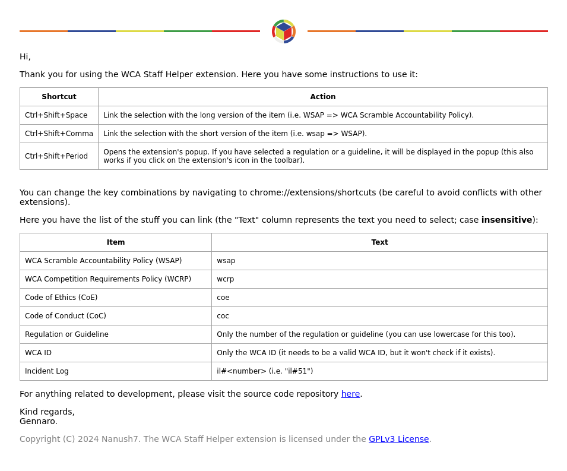

# WCA Staff Helper Extension

Copyright (C) 2024 Nanush7. This project is licensed under the terms of the [GPLv3 License](https://www.gnu.org/licenses/gpl-3.0.txt).

# General Information

Some WCA Staff members are constantly linking and referencing regulations and other documents. This extension was made to facilitate this task.

### Supported Sites

This extension works on the following sites (and it does **not** have access to any other site):

* The WCA Website (https://www.worldcubeassociation.org/).
* The WCA Forum (https://forum.worldcubeassociation.org/).
* Gmail.

### Features

You can do the following with keyboard shortcuts (see the instructions below):
* Display the wording of a regulation or guideline in a popup.
* Link WCA Regulations and Guidelines.
* Link WCA Documents.
* Link Incident Logs.
* Link WCA IDs.

### Code Quality Disclaimer

I am not a JavaScript developer and definitely not a frontend developer in general. You may want to read the code, but you should keep some sort of bucket next to you in case the code makes you throw up.

You are more than welcome to propose changes to make the code better, but refrain from making any harsh comments if you ended up with vomit all over your computer, I did what I could to warn you.

Joking aside, if you want to improve anything, including HTML and CSS, please let me know. At some point I will move to TypeScript and refactor some parts of the code.

### Privacy

This extension works locally/offline and does not transmit any kind of data over the Internet. This may change if a new feature needs to perform web requests (in such case, this section of the README will be updated).

# Installation

## Supported Web Browsers

## Chromium Based Browsers (Chrome, Brave, etc.)

To install the unpacked Chrome extension, follow these steps:

1. Download the latest version of the source code [here](https://github.com/Nanush7/wsh-extension/releases).
2. Open your Chromium based browser and go to the Extensions page by typing `chrome://extensions` in the address bar.
3. Enable the "Developer mode" toggle switch located at the top right corner of the page.
4. Click on the "Load unpacked" button.
5. Select the unzipped folder you downloaded. **If you move the folder, you will need to load the extension again.**
6. Restart your browser.

To **update** the extension, you just need to replace the entire folder, and then reload the extension from the `chrome://extensions` page (by clicking on the round arrow).

# Instructions

# Other

DOMPurify (purify.min.js) used without modifications, under the terms of the [Apache License Version 2.0](http://www.apache.org/licenses/LICENSE-2.0).
Copyright 2023 Dr.-Ing. Mario Heiderich, Cure53.

Google Material Symbols used without modifications, under the terms of the [Apache License Version 2.0](http://www.apache.org/licenses/LICENSE-2.0).
